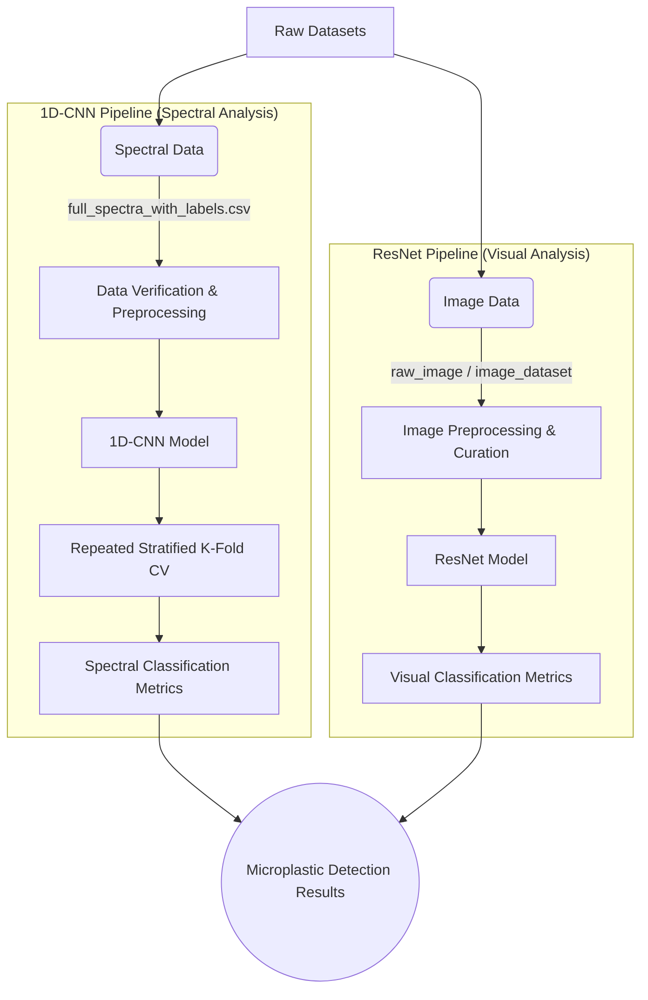

# Microplastic Detection using Deep Learning

This repository contains the code and resources for a research project focused on detecting and classifying microplastics using advanced deep learning techniques, specifically 1D Convolutional Neural Networks (1D-CNN) and ResNet architectures.

## Overview

The primary objective of this project is to develop robust machine learning models capable of analyzing environmental samples to accurately identify microplastic particles. The project leverages two distinct modalities of data:
1. **Spectral Data:** Analyzed using a designed 1D-CNN to detect characteristic signatures of different polymer types.
2. **Image Data:** Processed using ResNet models for visual classification of microplastics.

## Directory Structure

*   **/1d cnn/**: Contains all source code, Jupyter notebooks, and trained models related to the 1D-CNN spectral data analysis. This includes data loading, model training, and extensive robustness evaluations (like Repeated Stratified K-Fold cross-validation).
*   **/restnet_model/**: Houses the implementation of the ResNet architecture tailored for image-based microplastic detection, along with pre-processing scripts and evaluation metrics.
*   **/project documnets/**: Contains project reports, presentations, and other related documentation.
*   **/downloaded_dataset/**: Raw datasets downloaded for the project.
*   **/raw_image/**: Original, unprocessed image data of microplastic samples.
*   **/image_dataset/**: Processed and curated image datasets ready for training the ResNet model.
*   **full_spectra_with_labels.csv**: The primary dataset for the 1D-CNN model, containing the spectral readings mapped to their corresponding microplastic classifications.

*   ## Project Architecture

## Key Features & Evaluation

*   **Robustness Analysis**: The 1D-CNN models have undergone rigorous evaluation, including Repeated Stratified K-Fold cross-validation, to ensure consistent and reliable performance across different data splits.
*   **Comprehensive Metrics**: Evaluation is based on detailed classification reports (Precision, Recall, F1-Score) and confusion matrices to deeply understand the model's behavior on individual classes.
*   **Overfitting & Leakage Audits**: Extensive checks for data leakage (e.g., removing duplicate spectral rows) and learning curve analyses are performed to mitigate overfitting risks.

## Usage

Instructions for setting up the environment, preparing the datasets, and running the training/evaluation scripts reside in the respective model directories (`1d cnn/` and `restnet_model/`). Ensure you have the necessary dependencies installed (e.g., PyTorch, scikit-learn, pandas).
